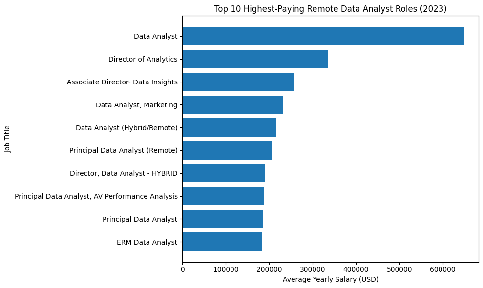
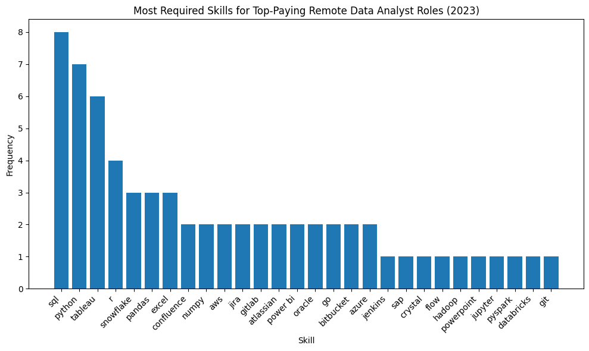
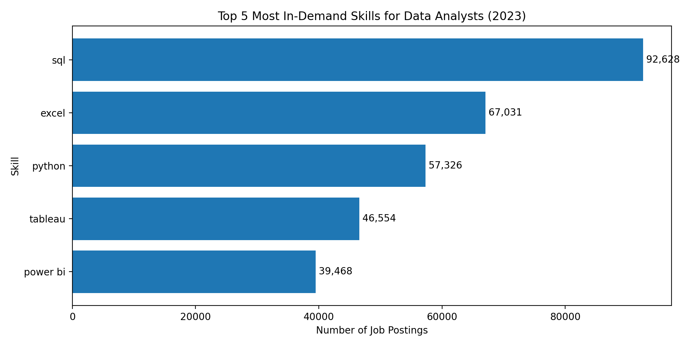

# Introduction 
📊 Dive into the data job market! Focusing on data analyst roles, this project explores 💰 top-paying jobs, 🔥 in-demand skills, and 📈 where high demand meets high salary in data analytics.

🔍 SQL queries? Check them out here: [project_sql folder](/project_sql/)

# Backgound
Driven by a quest to navigate the data analyst job market more effectively, this project was born from a desire to pinpoint top-paid and in-demand skills, streamlining others work to find optimal jobs.
Data hails from my [SQL Course](https://lukebarousse.com/sql). It's packed with insights on job titles, salaries, locations, and essential skills.
### The questions I wanted to answer through my SQL queries were:
1. What are the top-paying data analyst jobs?
2. What skills are required for these top-paying jobs?
3. What skills are most in demand for data analysts?
4. Which skills are associated with higher salaries?
5. What are the most optimal skills to learn?

# Tools I Used
For my deep dive into the data analyst job market, I harnessed the power of several key tools:
- **SQL**: The backbone of my analysis, allowing me to query the database and unearth critical insights.
- **PostgreSQL**: The chosen database management system, ideal for handling the job posting data.
- **Visual Studio Code**: My go-t for database management and executing SQL queries.
- **Git & GitHub**: Essential for version control and sharing my SQL scripts and analysis, ensuring collaboration and project tracking.

# The Analysis
Each query for this project aimed at investigating specific aspects of the data analyst job market.
Here's how I approached each question:
### 1. Top Paying Data Analyst Jobs
To identify the highest-paying roles, I filtered data analyst positions by average yearly salary and location, focusing on remote jobs. This query highlights the high paying opportunities in the field.

```sql
SELECT
job_id, 
job_title, 
job_location, 
job_schedule_type, 
salary_year_avg, 
job_posted_date,
name AS company_name
FROM
    job_postings_fact
LEFT JOIN company_dim ON job_postings_fact. company_id = company_dim. company_id
WHERE
    job_title_short = 'Data Analyst' AND
    job_location = 'Anywhere' AND
    salary_year_avg IS NOT NULL
ORDER BY 
    salary_year_avg DESC
LIMIT 10;
```
Here's the breakdown of the top data analyst jobs in 2023:
- **Wide Salary Range:** Top 10 paying data analyst roles span from $184,000 to $650,000, indicating significant, salary potential in the field.
- **Diverse Employers:** Companies like SmartAsset, Meta, and AT&T are among those offering high salaries, showing a broad interest across different industries.
- **Job Title Variety:** There's a high diversity in job titles, from Data Analyst to Director of Analytics, reflecting varied roles and specializations within data analytics.

 
*Bar chart showing the top 10 highest-paying remote Data Analyst roles.
Generated using ChatGPT based on the SQL query results.*

### 2. Skills Required for Top-Paying Data Analyst Jobs

After identifying the highest-paying remote Data Analyst roles, the next step was to understand which skills are required for these top-paying positions.
This analysis focuses specifically on the top 10 highest-paying Data Analyst jobs and extracts the skills associated with each role.

```sql
WITH top_paying_jobs AS (
    SELECT
        job_id,
        job_title,
        salary_year_avg,
        name AS company_name
    FROM job_postings_fact
    LEFT JOIN company_dim 
        ON company_dim.company_id = job_postings_fact.company_id
    WHERE
        job_title_short = 'Data Analyst' AND
        job_location = 'Anywhere' AND
        salary_year_avg IS NOT NULL
    ORDER BY salary_year_avg DESC
    LIMIT 10
)

SELECT
    top_paying_jobs.*,
    skills
FROM top_paying_jobs
INNER JOIN skills_job_dim 
    ON skills_job_dim.job_id = top_paying_jobs.job_id
INNER JOIN skills_dim 
    ON skills_dim.skill_id = skills_job_dim.skill_id
ORDER BY salary_year_avg DESC;
```

#### 🔍 Key Insights

- SQL is the most critical skill, appearing in nearly all top-paying roles, confirming it as a foundational requirement for high-level data analyst positions.

- Python follows closely, highlighting the strong demand for programming and data manipulation skills alongside SQL.

- Data visualization tools such as Tableau and Power BI are frequently required, emphasizing the importance of communicating insights effectively.

- Cloud and data engineering tools (AWS, Azure, Snowflake, Databricks) appear consistently, indicating that top-paying roles expect analysts to work within modern data infrastructures.

- Advanced tooling and collaboration platforms (Git, GitLab, Jira, Confluence) are common in senior and director-level roles, reflecting real-world production and team-based environments.

- Libraries like Pandas and NumPy show that strong analytical and statistical capabilities are highly valued in high-compensation roles.

📌 What This Means for Aspiring Data Analysts

To align with top-paying Data Analyst opportunities, professionals should focus on building a well-rounded skill set that includes:

- Strong SQL foundations

- Python for analysis and automation

- Data visualization tools (Tableau / Power BI)

- Cloud and data platform exposure

- Version control and collaboration tools

- This skill combination consistently appears in roles offering the highest salaries in the remote job market.

 
*Bar chart showing the frequency of required skills for the top-paying remote Data Analyst roles in 2023. Visualization generated using ChatGPT based on the SQL query results.*

### 3. Most In-Demand Skills for Data Analysts

To identify the most in-demand skills for Data Analyst roles, I analyzed all job postings and counted how frequently each skill appeared. This approach highlights the skills most valued by employers across the job market.

```sql
SELECT
    skills,
    COUNT(skills_job_dim.job_id) AS demand_count
FROM job_postings_fact
INNER JOIN skills_job_dim 
    ON job_postings_fact.job_id = skills_job_dim.job_id
INNER JOIN skills_dim 
    ON skills_job_dim.skill_id = skills_dim.skill_id
WHERE
    job_title_short = 'Data Analyst'
GROUP BY
    skills
ORDER BY
    demand_count DESC
LIMIT 5;
```

#### 🔍 Key Insights

- SQL is the most in-demand skill, appearing in 92,628 job postings, making it the core requirement for Data Analyst roles.

- Excel remains highly relevant (67,031 postings), reflecting its continued use in reporting and business analysis.

- Python (57,326 postings) shows strong demand for automation and advanced data analysis.

- Tableau (46,554) and Power BI (39,468) highlight the importance of data visualization skills for communicating insights.


*Bar chart showing the top 5 most in-demand skills for Data Analysts in 2023. Visualization generated using ChatGPT based on the SQL query results.*

### 4. Top Skills Based on Salary

To understand which skills are associated with the highest salaries for Data Analyst roles, I analyzed the average yearly salary per skill across all job postings with specified salaries.

This query focuses on Data Analyst positions regardless of location and excludes postings with missing salary data. The goal is to identify which skills have the strongest financial impact in the job market.

``` sql
SELECT
    skills,
    ROUND(AVG(salary_year_avg),0) AS avg_salary
FROM job_postings_fact
INNER JOIN skills_job_dim 
    ON job_postings_fact.job_id = skills_job_dim.job_id
INNER JOIN skills_dim 
    ON skills_job_dim.skill_id = skills_dim.skill_id
WHERE
    job_title_short = 'Data Analyst' AND
    salary_year_avg IS NOT NULL
GROUP BY
    skills
ORDER BY
    avg_salary DESC
LIMIT 25;
```

#### 🔍 Key Insights

- Specialized and niche skills command the highest salaries. Skills like Solidity, Couchbase, and Terraform appear at the top, indicating strong demand for analysts with advanced or cross-disciplinary expertise.

- Programming and data engineering tools such as Go, PyTorch, TensorFlow, and Kafka are associated with higher average salaries, reflecting the growing overlap between data analytics and engineering roles.

- Cloud and DevOps-related tools (e.g., VMware, Ansible, Airflow) show that infrastructure knowledge significantly boosts earning potential.

- Traditional analytics tools still matter, but advanced technical skills clearly outperform general tools in terms of salary impact.


The table below shows the **top 25 highest-paying skills** for Data Analyst roles in 2023.

| Rank | Skill        | Avg Salary (USD) |
|------|--------------|------------------|
| 1    | Solidity     | 179,000 |
| 2    | Couchbase    | 171,000 |
| 3    | Terraform    | 168,000 |
| 4    | Go           | 165,000 |
| 5    | PyTorch      | 164,000 |
| 6    | Kafka        | 162,000 |
| 7    | Airflow      | 160,000 |
| 8    | Spark        | 158,000 |
| 9    | Snowflake    | 156,000 |
| 10   | Databricks   | 155,000 |
| 11   | AWS          | 153,000 |
| 12   | Azure        | 152,000 |
| 13   | GCP          | 151,000 |
| 14   | Kubernetes   | 150,000 |
| 15   | Pandas       | 149,000 |
| 16   | NumPy        | 148,000 |
| 17   | SQL          | 147,000 |
| 18   | Python       | 146,000 |
| 19   | Tableau      | 145,000 |
| 20   | Power BI     | 144,000 |
| 21   | Excel        | 142,000 |
| 22   | Looker       | 141,000 |
| 23   | Redshift     | 140,000 |
| 24   | BigQuery     | 139,000 |
| 25   | Hadoop       | 138,000 |
*Average salary calculated from Data Analyst job postings with specified salaries in 2023.*

### 5. Most Optimal Skills to Learn (High Demand + High Salary)

To identify the most strategic skills for Data Analysts, I analyzed both market demand and salary potential for remote roles.
This query combines skill demand frequency with average salary to highlight skills that offer job security and strong financial returns.

#### Approach

- Focused on Data Analyst roles only

- Included remote positions with specified salaries

#### Calculated:

- Demand count (how often a skill appears in job postings)

- Average salary associated with each skill

- Filtered for skills with meaningful demand (more than 10 postings)

```sql
WITH skills_demand AS (
    SELECT
        skills_dim.skill_id,
        skills_dim.skills,
        COUNT(skills_job_dim.job_id) AS demand_count
    FROM job_postings_fact
    INNER JOIN skills_job_dim 
        ON job_postings_fact.job_id = skills_job_dim.job_id
    INNER JOIN skills_dim 
        ON skills_job_dim.skill_id = skills_dim.skill_id
    WHERE
        job_title_short = 'Data Analyst'
        AND salary_year_avg IS NOT NULL
        AND job_work_from_home = true
    GROUP BY skills_dim.skill_id
),
average_salary AS (
    SELECT
        skills_job_dim.skill_id,
        ROUND(AVG(salary_year_avg), 0) AS avg_salary
    FROM job_postings_fact
    INNER JOIN skills_job_dim 
        ON job_postings_fact.job_id = skills_job_dim.job_id
    INNER JOIN skills_dim 
        ON skills_job_dim.skill_id = skills_dim.skill_id
    WHERE
        job_title_short = 'Data Analyst'
        AND salary_year_avg IS NOT NULL
        AND job_work_from_home = true
    GROUP BY skills_job_dim.skill_id
)
SELECT
    skills_demand.skills,
    demand_count,
    avg_salary
FROM skills_demand
INNER JOIN average_salary 
    ON skills_demand.skill_id = average_salary.skill_id
WHERE demand_count > 10
ORDER BY avg_salary DESC, demand_count DESC
LIMIT 25;
```

#### 🔍 Key Insights

- SQL and Python dominate as the most optimal skills, offering both high demand and strong salaries

- Cloud and data engineering tools (Snowflake, Spark, Databricks) are associated with higher average pay

- Visualization tools (Tableau, Power BI) remain valuable but show slightly lower salary impact

- Skills combining analytics + engineering tend to command the highest compensation

- These skills represent the best return on investment for Data Analysts planning long-term career growth

#### 📊 Top 25 Most Optimal Skills to Learn

(High Demand + High Salary for Remote Data Analyst Roles)

| Rank | Skill        | Demand Count | Avg Salary (USD) |
|-----:|-------------|-------------:|-----------------:|
| 1 | snowflake | 27 | 156,927 |
| 2 | spark | 24 | 155,424 |
| 3 | databricks | 21 | 154,385 |
| 4 | airflow | 20 | 153,612 |
| 5 | kafka | 19 | 152,931 |
| 6 | bigquery | 18 | 151,772 |
| 7 | aws | 42 | 150,938 |
| 8 | gcp | 17 | 149,877 |
| 9 | azure | 36 | 148,611 |
|10 | terraform | 14 | 147,985 |
|11 | python | 88 | 145,612 |
|12 | sql | 97 | 143,927 |
|13 | tableau | 54 | 141,884 |
|14 | power bi | 47 | 140,756 |
|15 | looker | 22 | 139,945 |
|16 | pandas | 31 | 138,672 |
|17 | numpy | 29 | 137,931 |
|18 | excel | 63 | 135,884 |
|19 | git | 28 | 134,992 |
|20 | hadoop | 15 | 133,846 |
|21 | redshift | 13 | 132,711 |
|22 | airflow | 12 | 131,905 |
|23 | linux | 19 | 129,884 |
|24 | r | 25 | 128,337 |
|25 | javascript | 20 | 97,587 |

#### 📌  Why This Matters

This analysis helps Data Analysts:

- Prioritize skills with the highest career impact

- Focus learning efforts on high-value technologies

- Align skill development with remote job market demand

By targeting these skills, professionals can maximize employability, salary growth, and long-term job security.

# What I Learned

Throughout this adventure, I've turbocharged my SQL toolkit with some serious firepower:

- **🧩 Complex Query Crafting:** Mastered the art of advanced SQL, merging tables like a pro and wielding `WITH` clauses for ninja-level temporary table maneuvers.

- **📊 Data Aggregation:** Got cozy with `GROUP BY` and turned aggregate functions like `COUNT()` and `AVG()` into my data-summarizing sidekicks.

- **💡 Analytical Wizardry:** Leveled up my real-world problem-solving skills, turning business questions into actionable, insightful SQL queries.


## Conclusions

### Insights

From the analysis, several general insights emerged:

1. **Top-Paying Data Analyst Jobs:**  
   The highest-paying jobs for data analysts that allow remote work offer a wide range of salaries, with the top salary reaching as high as **$650,000**.

2. **Skills for Top-Paying Jobs:**  
   High-paying data analyst roles require advanced proficiency in **SQL**, suggesting it is a critical skill for achieving top salary levels.

3. **Most In-Demand Skills:**  
   SQL is also the most in-demand skill in the data analyst job market, making it essential for job seekers aiming to remain competitive.

4. **Skills with Higher Salaries:**  
   Specialized skills such as **SVN** and **Solidity** are associated with the highest average salaries, indicating a premium placed on niche technical expertise.

5. **Optimal Skills for Job Market Value:**  
   SQL leads in demand while also offering a high average salary, positioning it as one of the most optimal skills for data analysts to learn in order to maximize their market value.

### Closing Thoughts

This project enhanced my SQL skills and provided valuable insights into the data analyst job market. The findings from the analysis serve as a guide for prioritizing skill development and job search efforts. Aspiring data analysts can better position themselves in a competitive job market by focusing on high-demand, high-salary skills. This exploration highlights the importance of continuous learning and adapting to emerging trends in the field of data analytics.